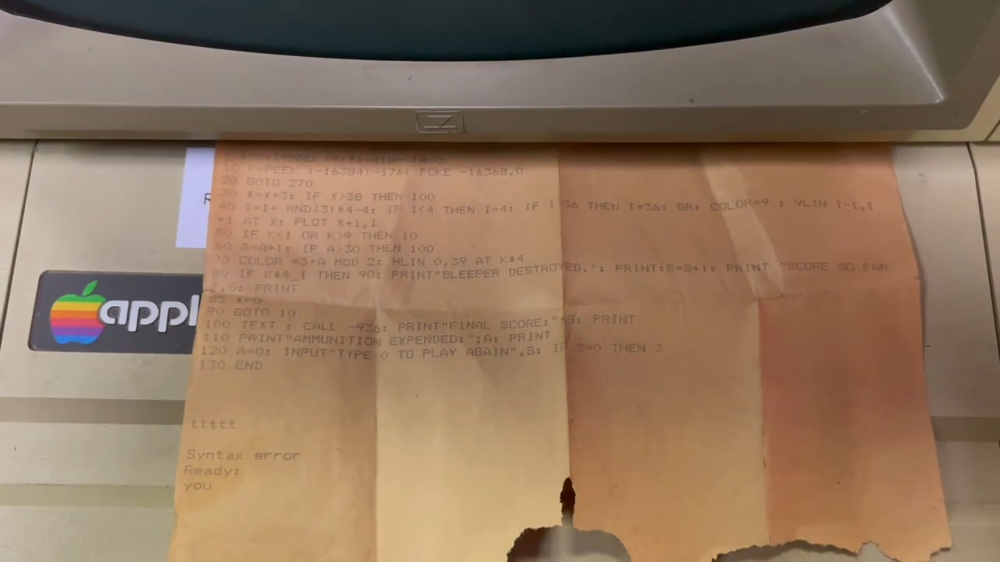

I reverse engineered a simple game written in BASIC from this print out, the code snippet was incomplete, however I have made a working demo.

The aim of the game is to predict the vertical position of a "beeper" moving up and down as it crosses the screen.


From [hackmodular](https://www.youtube.com/@hackmodular)


### Line 3:

```basic
3 X=0:I=(INT(RND(1) * 9) + 1) * 4 :A=0 : HOME
```

Initialises X (horizontal position) and A (ammunition used) to zero and picks a random vertical position (row) for the target with I.

### Line 10:

```basic
10 K=PEEK(-16384)-176: POKE -16368,0
```

PEEK is used to get a value from memory, the location -16384 reads which key was pressed on the keyboard. POKE is used to set a value to a memory address, -16368 resets the keyboard flag so another character can be read after it was just with PEEK.

The subtraction of -176 is done as a subtraction of 127 finds the ASCII code for the key. A further subraction of 48 is done because 48 is the ASCII code for zero. Therefore, the number keys are mapped to a value between 1 and 9.

### Line 30:

```basic
30 X=X+3: IF X>38 THEN 100
```

This checks if the target is still on the screen, when X is greater than 38 it goes to line 100 which prints the final score. The game ends when the target leaves the screen to the right.

### Line 40:

```basic
40 I=I+RND(3)*4-4:
    IF I<4 THEN I=4: IF I>36 THEN I=36:
    GR: COLOR=9 : VLIN I-I, I+1 AT X: PLOT X+1,I

```

Randomly moves the target up and down and makes sure it's still on the screen.
Then enables the graphics mode and draws a vertical line down to the target, then a dot to the right of the line. The target travels across the screen 3 columns at a time with the variable X.

### Line 50:

```basic
50 IF K<1 OR K>9 THEN 10
```

If an invalid key was pressed look for a new keypress.

### Line 60:

```basic
60 A=A+1: IF A>30 THEN 100
```

Increments the amount of ammunition used and ends the game if the user has consumed over 30.

### Line 70:

```basic
70 COLOR=3+A - (INT(A / 2) * 2): HLIN 0, 39 AT K*4
```

Draws a horizontal line at the position that the user entered on the keypad. It's multiplied by 4 to map the 1-9 to 4-36 which is were the target can move. The user can select row 4, 8, 12, 16, 20, 24, 28, 32 or 36.

The colour is also changed.

### Lines 80-90:

```basic
80 IF K*4=I THEN PRINT"BLEEPER DESTROYED.": PRINT:S=S+1: PRINT "SCORE SO FAR:",S: PRINT
85 X=0
90 GOTO 10
```

If the position that the user entered is the position of the target then print bleeper destroyed. Then it increments your score and returns to the first line to start the game again by resetting the column of the target to zero on line 85 and going back to the start of the program on line 90.

### Line 100:

```basic
100 TEXT : CALL -936: PRINT"FINAL SCORE:",S: PRINT
```

Calls the subroutine -936 which clears the entire text screen and moves the cursor to the upper left-hand corner.

### Lines 270-271 (modified.bas):

```basic
270 FOR D = 1 TO 2000: NEXT D
271 GOTO 30
```

These are lines that I added to act as a delay, increasing the number of loops slows the game down.

In summary, a target is moving across the screen from left to right, the user enters a number which corresponds to a row on the screen. If the user hits the target with the correct position, the score is increased and the beeper starts again. If the beeper gets to the right of the screen without being hit or you run out of ammo then you lose.

The GR keyword for enabling graphics is only available on the Apple II, but then the program also uses the MOD keyword which is only available on with Integer Basic. You can run Integer Basic on the Apple II but it's seems quite complex from the manual (I have no idea about any of this). In my version I just replaced the modulus operator.

[Apple 2 Manual](https://vintageapple.org/apple_ii/pdf/Apple_II_Users_Guide_For_Apple_II_Plus_and_Apple_IIe_1985.pdf)
